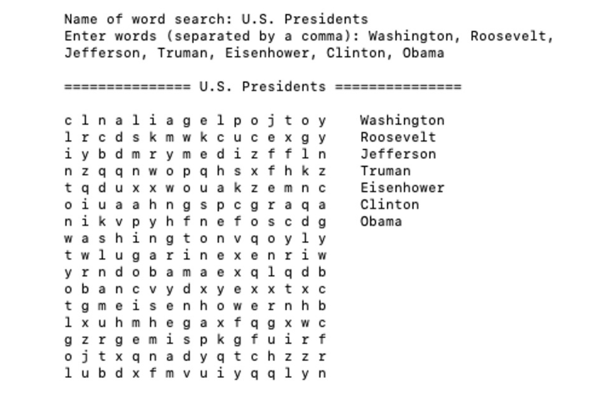

# Word Search Creator

Creates a word search puzzle with any words!



## Description

Word Search Creator provides several Python programs that allow you to create word search puzzles with any given words and a title. There is a command line interface, as well a Python function to generate word searches.

There are three files in the repo for creating word searches:

 - ```word_search_creator.py``` &mdash; contains several Python functions for generating word searches
 - ```word_search_app.py``` &mdash; utilizes functions contained in ```word_search_creator.py``` to create a Python user-interface for creating word searches
 - ```word_search_app_compiled.py``` &mdash; ```word_search_app.py```, although it is a single file and includes the ```word_search_creator.py``` dependency within it's own file

## Using Word Search Creator

If you'd just like to generate word searches, simply type the following two commands into your command line:

```bash
$ curl https://xtrp.github.io/word_search_creator/word_search_app_compiled.py -o word_search.py
$ python word_search.py
```

If instead you are a developer and you'd like to use the functions that ```word_search_creator.py``` and other files in this repo contain, simply clone or download this repo with the following command: 

```bash
$ git clone https://github.com/xtrp/word_search_creator
```

## Credits and License

Word search creator was written by [Gabriel Romualdo](https://xtrp.io/). It is licensed under the MIT License. For more information, see LICENSE.txt.
